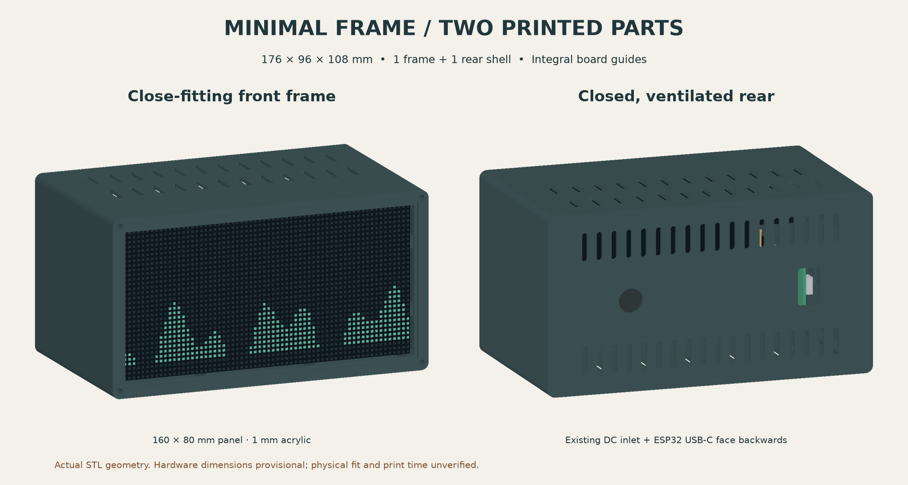
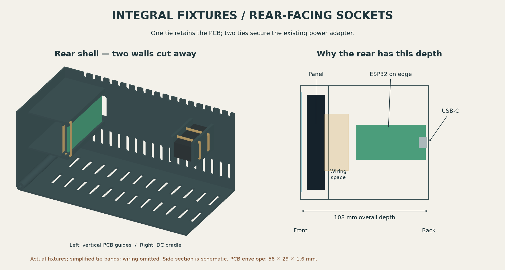

# Fiche atelier — cadre minimal, arrière fermé

**Deux pièces imprimées installées : un cadre et une coque arrière ventilée.**
Le panneau est maintenu par ses inserts arrière ; l'ESP32 est immobilisé dans
des glissières intégrées. Sa prise USB-C et le connecteur d'alimentation existant
sortent directement sur la face arrière. Le bloc secteur reste à l'extérieur.

Les contrôles numériques passent. **Ajustement physique non vérifié** : mesurer
l'ESP32, le connecteur DC et les fiches avant de lancer la grande coque.

## À fabriquer

| Fichier | Quantité | Dimensions, mm | Face sur le plateau |
| --- | --- | --- | --- |
| `stl/frame.stl` | 1 | 176 × 96 × 23,3 | Arrière du cadre, avec les quatre oreilles |
| `stl/rear.stl` | 1 | 176 × 96 × 84,7 | Face arrière extérieure, avec les prises |
| `acrylic-outline.svg` | 1 plaque | 164 × 84 × 1 | Découpe, coins de rayon 1 mm |

Boîtier assemblé : **176 × 96 × 108 mm**, hors têtes de vis et fiches branchées.
L'ESP32 est placé sur chant pour orienter sa prise USB-C vers l'arrière. Sa
longueur explique la profondeur ; aucun câble USB de rallonge n'est nécessaire.
L'acrylique fourni de 180 × 130 × 1 mm doit être recoupé. Importer le SVG à 100 % :
la page mesure 166 × 86 mm, le contour à découper 164 × 84 mm.

Les STL sont déjà orientés sur Z=0. Ne pas les redimensionner. Chaque pièce tient
sur un plateau de 220 × 220 mm, bordure de 5 mm comprise. Elles tiennent également
ensemble : cadre et coque espacés de 10 mm, enveloppe de 186 × 212 mm avec bordure.
Sur deux imprimantes, affecter le cadre à l'une et la coque à l'autre ; le temps
écoulé dépend alors de la pièce la plus longue.

Utiliser le profil matière/machine validé de l'atelier. Point de départ à trancher :
buse de 0,4 mm, couches de 0,20 à 0,28 mm ; conserver les parois de 1,6 mm de la
coque et le fond de 1,8 mm. Le modèle privilégie les parois verticales et les
petits ponts de 3 à 3,4 mm. Inspecter les évents, rainures et fenêtres de colliers
dans le trancheur. La façade possède un épaulement en pente pour l'orientation
indiquée. Impression sans supports visée, à confirmer dans le trancheur.

Volume géométrique plein : 165,5 cm³, soit environ 205 g à 1,24 g/cm³. Ce n'est
ni la consommation du trancheur ni un temps garanti. La contrainte de six heures
est abandonnée ; on vise une fabrication relativement rapide avec peu de pièces.

## Vérifier l'ajustement

- Panneau nominal : **160 × 80 × 14,5 mm**, inserts M3 extérieurs à entraxe
  **125 × 65 mm**. Jeu du logement : **0,35 mm par côté**.
- Essayer `fit-tests/fit_corner.stl` sur un coin du panneau. L'essai ne vérifie
  pas tout l'entraxe des inserts. Le PCB se teste avec `board_gauge.stl`.
- PCB provisoire : **58 × 29 × 1,6 mm** ; rainures de **2,2 mm**, engagement
  de **0,8 mm** sur chaque bord long. Ces bords doivent être libres de composants.
  La face composants est tournée vers la paroi latérale, avec une réserve
  modélisée de 25 mm pour les connecteurs/fils.
- Vérifier l'emplacement réel de l'USB-C : ouverture arrière **12 × 20 mm**,
  fiche testée numériquement dans une enveloppe de **10 × 14 mm**. Le PCB est
  arrêté à 2,8 mm de la face extérieure ; le nez USB supposé dépasse de 1,5 mm.
- Adaptateur DC provisoire : corps **35 × 16 × 14 mm**, nez supposé Ø11 mm,
  passage Ø13 mm. Mesurer le corps, la position de la prise, l'épaulement et
  l'accès aux borniers. Le berceau retient l'adaptateur au moyen de deux colliers.
- Réserve numérique derrière le panneau : **20 mm** sur une zone de 148 × 48 mm.
  Vérifier la place avec les fils réellement branchés et leurs courbures.

Les essais sont facultatifs dans le kit et ne restent pas dans l'assemblage.
Les dimensions se modifient en tête de `model.scad` ; reconstruire les STL et
relancer `validate.py` après modification. Les fichiers `reference/` représentent
le matériel pour les contrôles : **ne pas les imprimer**.

## Quincaillerie et montage

- 4 vis **M3 × 30 mm** pour fermer le boîtier : environ 6,7 mm d'engagement dans
  les avant-trous de 2,6 mm, profonds de 11 mm. Préparer/tester le vissage sans forcer.
- 4 vis M3 courtes pour le panneau : elles traversent **3 mm** de plastique,
  puis les inserts du panneau. Mesurer la profondeur utile des inserts pour
  choisir la longueur ; elle n'est pas connue.
- 3 colliers fins, largeur **2,5 mm** : un pour le PCB, deux pour le DC ; prévoir
  une longueur suffisante (100 mm convient aux enveloppes modélisées).
- Petites bandes d'adhésif démontable pour l'acrylique ; patins adhésifs si souhaité.

1. Introduire le panneau **par l'avant du cadre**, puis visser ses quatre inserts
   depuis l'arrière à travers les oreilles. Il ne doit pas être forcé dans le cadre.
2. Poser l'acrylique par l'avant dans sa feuillure, avec de petites bandes
   d'adhésif démontable sur la portée d'environ 1,65 mm. Ne pas coller les LED.
3. Coque ouverte, glisser le PCB **extrémité USB en premier** dans les deux
   rainures. Le connecteur doit arriver dans la fenêtre arrière. Passer un collier
   par les deux fenêtres fermées situées juste au-dessus de l'autre extrémité du
   PCB ; il empêche le PCB de ressortir. Placer la tête du collier hors des composants.
4. Poser le connecteur DC contre l'ouverture ronde. Faire passer deux colliers
   autour du corps et à travers les fenêtres opposées du berceau. Les serrer
   suffisamment pour empêcher le connecteur de bouger lors du branchement.
5. Brancher le câblage en gardant une boucle pour rouvrir. Contrôler le passage
   des fiches USB/DC et la retenue du matériel, puis joindre cadre et coque.
6. Fermer avec les quatre M3 × 30 depuis les coins de la face avant. Pour ouvrir,
   enlever ces quatre vis ; le PCB et le DC restent fixés à la coque arrière.
7. Tester affichage, USB, Wi-Fi et température en usage prolongé. Conserver la
   règle du projet : débrancher l'entrée externe 5 V de l'ESP32 lorsqu'il est
   alimenté par l'USB de l'ordinateur.

